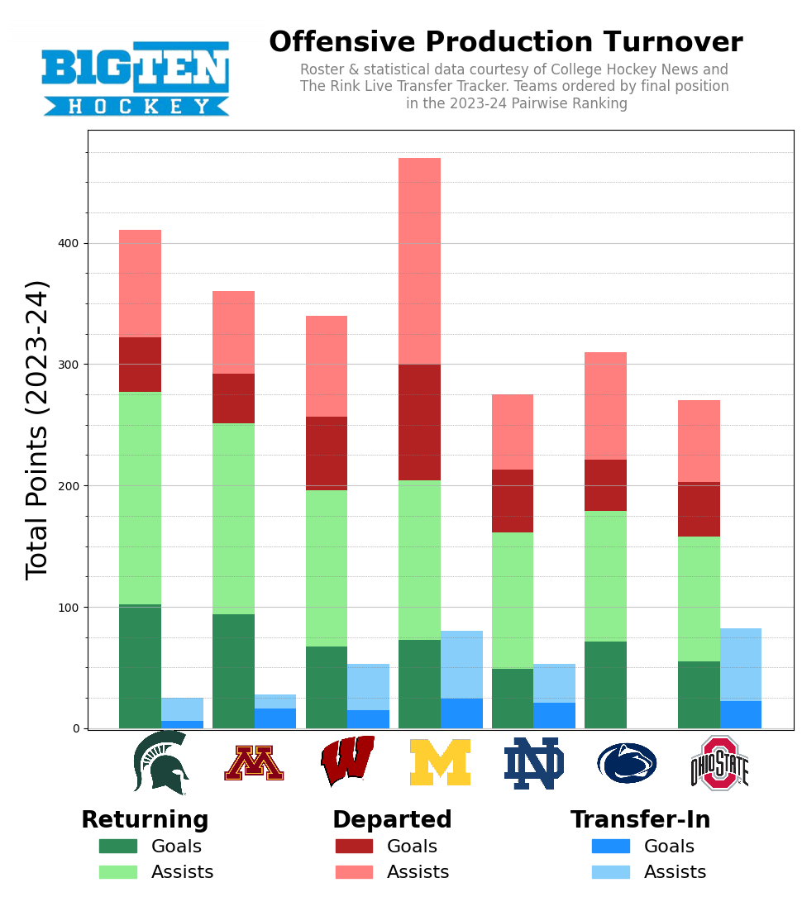
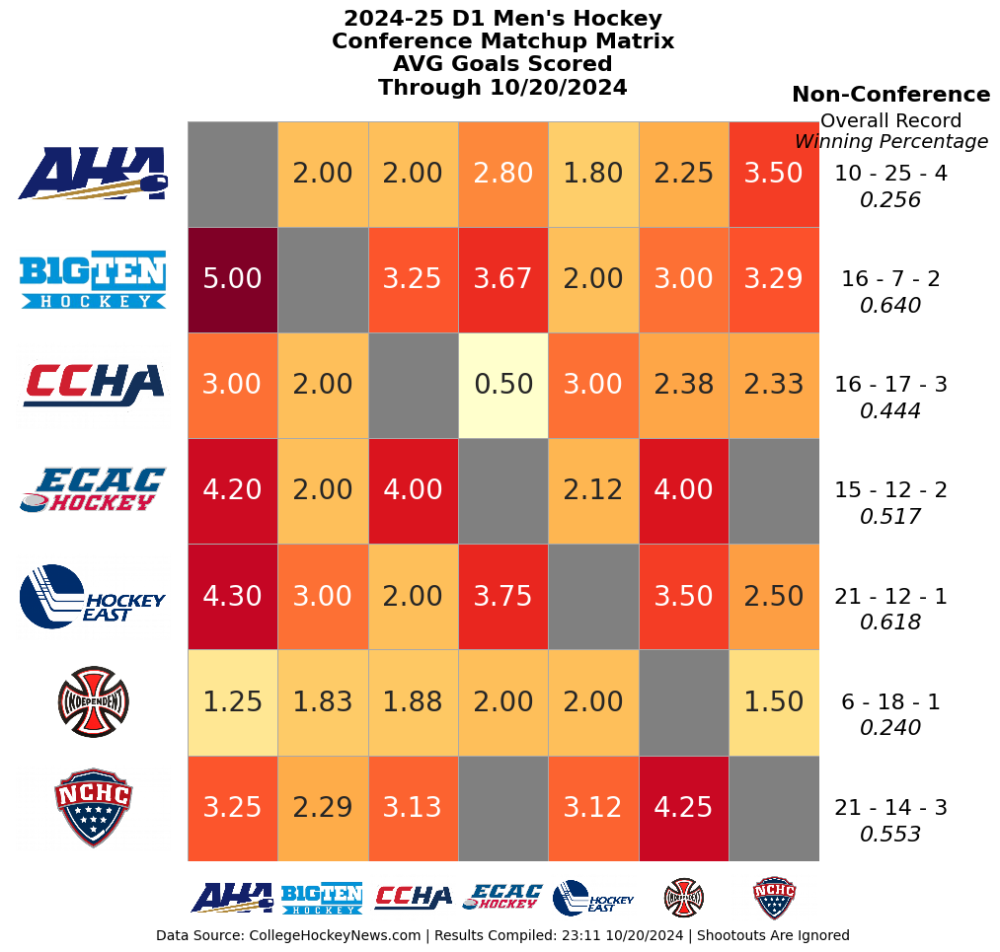
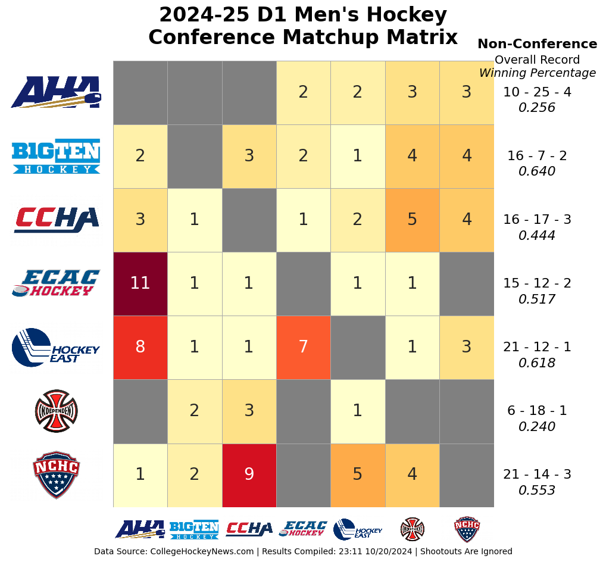

# College Hockey Analysis 2024-25 Season

#### Data Sources:
- [CollegeHockeyNews.com](http://https://www.collegehockeynews.com/) 
- [The Rink Live's](https://www.therinklive.com/)

---

## Workbooks
- [Roster Scraping and Cleaning](#roster-scraping-and-cleaning)
- [Game Data Scraping and Cleaning](#1-game_data_scraper_1ipynb)
- [Player Origins Map Visualization](#player-origins-and-map-visualization)
- [Team Composition Analysis by Class Rank and Age](#team-composition-analysis-by-class-rank-and-age)
- [Team Travel Analysis](#team-travel-analysis)
- [Imperial Mapping Workbook](#imperial-mapping-workbook)
- [Preseason Production Plots](#preseason-production-plots)
- [Conference Heatmap Visualization](#conference-heatmap-visualization)

---

### Roster Scraping and Cleaning
This Jupyter Notebook performs automated data scraping and cleaning to compile a master roster dataset for all Division 1 college hockey teams for the current season, using CollegeHockeyNews.com as the primary data source.
**Files:**
- **Code:** *[roster_scrape_and_clean.ipynb](/workbook/roster_scrape_and_clean.ipynb)*
- **Output:** *[roster_2024_current_v2.csv](/data/roster_2024_current_v3.csv)*

**1. Data Scraping:**

- The notebook scrapes player roster information from each team’s page on College Hockey News. This is done by extracting a list of teams from the CHN season schedule and iterating through the team-specific URLs, retrieving roster data, and parsing the HTML content.
- The scraping process extracts all available details from the target page: player names, positions, heights, weights, draft, previous team and hometown information.

**2. Data Cleaning:**

- After scraping, various transformations are applied to standardize the dataset
    - Columns are cleaned for consistency in naming and formatting.
    - Duplicate or missing data are handled appropriately, ensuring the integrity of the dataset.
    - Team names and associated IDs are correctly matched with the scraped data.

**3. Data Transformation:**

- The hometown information is split into separate columns for City, State/Province, and Country, facilitating detailed geographic analysis.
    - The transformations also include correcting for different formats of hometowns and ensuring all countries are properly labeled.
- Player height is converted from feet and inches to inches for easier analysis.

**4. Data Analysis (Preview):**
- The notebook provides a brief overview of the resulting dataset by displaying distribution summaries:
    - Histograms of height and weight distribution
    - Distribution of player positions
    - Distribution of first and last names
    - Hometown, State/Province and Country distribution

**5. Final Output:**
- The notebook outputs a cleaned and structured master roster table for all teams, ready for further analysis or integration into other projects.

| Current Team   | Last_Name   | First_Name   |   No | Position   | Yr   | Ht   |   Wt | DOB       | Hometown               |   Height_Inches |   Draft_Year |   NHL_Team |   D_Round | Last Team   | League   | City             | State_Province   | Country   |
|:---------------|:------------|:-------------|-----:|:-----------|:-----|:-----|-----:|:----------|:-----------------------|----------------:|-------------:|-----------:|----------:|:------------|:---------|:-----------------|:-----------------|:----------|
| Lake Superior  | Barone      | Adam         |    6 | Defensemen | Fr   | 6-1  |  174 | 5/6/2004  | Sault Ste. Marie, Ont. |              73 |          nan |        nan |       nan | Trail       | BCHL     | Sault Ste. Marie | Ont.             | Canada    |
| Lake Superior  | Blanchett   | Jack         |   16 | Defensemen | So   | 5-11 |  185 | 5/12/2003 | Monroe, Mich.          |              71 |          nan |        nan |       nan | Powell      | BCHL     | Monroe           | Mich.            | USA       |
| Lake Superior  | Brown       | Mike         |    3 | Defensemen | Jr   | 6-2  |  209 | 4/3/2001  | Belmont, Mass.         |              74 |          nan |        nan |       nan | Merrimack   | nan      | Belmont          | Mass.            | USA       |
| Lake Superior  | Bushy       | Evan         |    5 | Defensemen | So   | 6-1  |  195 | 3/26/2002 | Mankato, Minn.         |              73 |          nan |        nan |       nan | Trail       | BCHL     | Mankato          | Minn.            | USA       |
| Lake Superior  | Conrad      | Jacob        |    4 | Defensemen | Fr   | 5-11 |  180 | 5/18/2002 | Green Bay, Wis.        |              71 |          nan |        nan |       nan | Fairbanks   | NAHL     | Green Bay        | Wis.             | USA       |

This tool is a robust foundation for deeper analysis into Division 1 college hockey player demographics, including geographic trends, physical attributes, and more. The clean dataset it produces can easily be integrated into various analysis workflows or visualizations, such as travel or team comparisons.

[Back To Menu](#workbooks)
---

## Game Data Scraper and Cleaner

This section outlines the purpose and functionality of two Jupyter notebooks used to scrape, clean, and prepare game data for further analysis.

### 1. Game_Data_Scraper_1.ipynb

This notebook automates the process of scraping game data for the current college hockey season from **College Hockey News**.

- **Primary Tasks:**
  - Scrapes game schedules and results for the selected season.
  - Filters out exhibition games to maintain relevant game data.
  - Includes functions to parse box scores and advanced metrics for each game.
  - Stores scraped data in a **SQLite database** for easy querying and further processing.

- **Features:**
  - **Error Handling:** Logs errors and warnings during scraping to ensure data integrity.
  - **Database Management:** Compares scraped game data with existing records to avoid duplicating entries.
  - **Modular Functions:** Includes reusable functions for scraping individual game metrics, saving results, and managing SQLite database connections.

- **Output:**  
  - Creates or updates a SQLite database with the latest game statistics.
  - Provides a **games_df** DataFrame with all relevant game information, ready for analysis.

---

### 2. Game_Data_Cleaner.ipynb

This notebook handles the post-scraping cleanup and transformation of raw game data. It ensures the data is structured for further analysis by cleaning inconsistencies, merging datasets, and adding relevant columns.

- **Primary Tasks:**
  - Adds missing team names to individual player rows within the advanced metrics data.
  - Combines multiple tables into a single, comprehensive table with proper formatting.
  - Adds **Home** or **Away** information based on game identifiers.
  - Integrates **master roster** data to join with game statistics for enriched analysis (e.g., player age, class rank, etc.).

- **Data Cleaning Steps:**
  - Creates mappings between team names and abbreviations to handle discrepancies in source data.
  - Renames columns for easier analysis (e.g., "Pt." to "Pts" and "+/-" to "plus_minus").
  - Ensures consistent naming across tables and removes extra header rows from player statistics.

- **Output:**  
  - Produces a cleaned SQLite database with all the necessary transformations applied.  
  - Exports player and game data, ready for use in other parts of the project.

These two notebooks form the backbone of the project, ensuring that raw game data is both accurately collected and effectively cleaned for future use. The cleaner notebook complements the scraper by transforming data into a consistent format that can be readily analyzed or integrated into other workflows.

[Back To Menu](#workbooks)
---
### Player Origins and Map Visualization

This Jupyter notebook provides a visualization of NCAA college hockey players' origins, mapping them by city, state, and country. It also includes options to filter the map based on specific layers, such as player heatmaps, individual players, or state-level player counts. The visualizations are designed to provide insights into the geographic distribution of players, enabling better understanding of recruitment trends and regional representation.

#### Files:
- **Notebook:** *[players_by_location.ipynb](/workbook/players_by_location.ipynb)*

#### Map Outputs:
  - Player markers using team logos by individual location, including detailed tooltips.
  - Choropleth layer representing player counts by state/province.
  - Heatmap showing high-density player origin areas.

#### Steps in the Notebook:
**1. Data Loading and Preparation:**
- The notebook loads player data that includes their city, state/province, and country of origin, as well as player-specific information such as team, position, and year.
- It merges geocoded location data (latitude and longitude) with player details, ensuring that each player is accurately represented on the map.
  
**2. Map Creation:**
- A Folium map is created, starting with an OpenStreetMap base layer. The user can switch between different map themes (dark, light, or default).
- The primary visualization layers include:
  - **Player Count by State/Province:** A choropleth layer that shades states or provinces based on the number of players originating from that region.
  - **Individual Player Markers:** Markers display each player’s details in a tooltip (name, team, position, hometown), as shown in the Calgary example screenshot.
  - **Heatmap:** A heatmap is overlaid to visually highlight areas with high player concentrations.
  
**3. Interactive Map Controls:**
- The user can toggle map layers (heatmap, player count by state, individual player markers) via an interactive control panel, shown in the controls screenshot.
- Additional layers can be activated, providing flexibility in how the data is visualized.

#### Screenshots:
- **Calgary Example:** Displays individual player markers for players from Calgary, with a tooltip containing detailed player information (e.g., name, team, position).
  
  
- **Player Count Choropleth (US & Canada):** Shows player counts shaded by state/province, with high representation in areas like Michigan, Minnesota, and Ontario.
  
  
- **Map Controls:** A simple control panel allows users to toggle map layers like heatmaps, individual players, and state player counts.
  

#### Results and Insights:
The map visualizations offer a clear overview of where NCAA hockey players come from, allowing users to:
- Identify geographic hotspots for player recruitment.
- Visualize the density of players in specific regions using heatmaps.
- Filter and explore player data by team or conference through interactive map features.

This notebook provides a useful tool for understanding the distribution of hockey talent across North America, and it can help guide recruiting strategies and regional analyses.

[Back To Menu](#workbooks)
---

### Team Composition Analysis by Class Rank and Age

**Files:**
- **Code:** *[age_experience_plots.ipynb](/workbook/age_experience_plots.ipynb)*

This notebook is designed to analyze and visualize the makeup of college hockey teams by class rank (Freshman, Sophomore, Junior, Senior, Graduate) and average age. Using team roster data, it performs data transformation to aggregate the proportions of each class rank per team, along with the team's average age.

**Key Features:**
- **Data Transformation:** The notebook processes team roster data and calculates the proportion of players in each class rank, as well as the team's average age. The final transformed data can be adapted to analyze different conferences or groups of teams.

- **Dynamic Plotting Function:** A core feature of this notebook is a customizable function that generates stacked bar charts representing the class rank distribution for each team in a given conference. The function is adaptable, allowing you to switch between different conferences with minimal adjustments to the input data.

- **Visual Insights:** The stacked bar charts provide clear visual insights into how teams are composed across different experience levels (class ranks) and can help identify trends such as team reliance on younger or older players.

**Usage:**
To adapt this notebook for another conference or group of teams, simply adjust the input dataset to reflect the teams and roster information of interest. The plotting function will automatically update to reflect the new data.

This notebook can be extended to support a variety of visualization needs within the context of college hockey analytics, making it a versatile tool for exploring team composition and player experience.

#### **Example of output images:**

[Back To Menu](#workbooks)
---

### Team Travel Analysis

This Jupyter notebook analyzes the total travel distance for each NCAA college hockey team during the regular season, based on the scheduled games and arena information. The goal is to quantify the travel burden on each team, breaking it down by regular (home/away) and neutral site games.

#### Files:
- **Notebook:** *[distance_traveled.ipynb](/workbook/distance_traveled.ipynb)*
- **Schedule Information:** *[CHN_Schedule_First_Pass_v1.csv](/data/schedule/CHN_Schedule_First%20Pass_v1.csv)*
- **Arena Information:** *[arena_school_info.csv](/data/arena_school_info.csv)*
- **Neutral Site Arenas:** *[neutral_arenas_2024.csv](/data/neutral_arenas_2024.csv)*

#### Steps in the Notebook:
**1. Data Preparation:**
- Loads the schedule, home arena, and neutral site data. The analysis focuses on regular season games and excludes exhibition matchups.
- Consecutive games at the same location within 3 days are treated as a single trip to reflect real-world travel practices.

**2. Distance Calculation:**
- The geodesic distance between each team's home arena and the opposing team’s arena is calculated using the geopy library. For neutral site games, distances are calculated between each team’s home arena and the neutral site.
- All distances are reported in miles and represent the straight-line distance between locations.
- Total travel distance for each team is computed by summing the distances for all away and neutral site games. The average distance traveled per game is also calculated.

**3. Results:**
The notebook produces a table that includes:
- The total number of trips for each team, separated into regular season and neutral site trips.
- The total distance traveled for regular and neutral site games, along with the average distance per game.
- The closest team geographically to each school and how many times they play that team during the season.
- The longest trip in each team's schedule, specifying the opponent and whether the game is regular season or neutral site.

These results provide insights into the travel demands placed on each team and can highlight significant travel disparities between teams and conferences.

The [final table](/data/output/Team_Travel_Information_v1.csv) provides a full breakdown of travel statistics for each team, including total trips, total distance, closest opponent, and longest trip. This data helps assess the impact of travel on team performance and can inform discussions on scheduling efficiency and travel fairness across teams and conferences.

<!-- OLD ORIG README - BASED ON OLD ORIGNAL CODE This Jupyter notebook calculates the total travel distance for each NCAA college hockey team during the regular season, based on the schedule of games and information about each team's home arena. The goal of this analysis is to assess the travel burden on each team throughout the season, broken down into regular (on campus) and neutral site games.

#### Files:
- Notebook: *[distance_traveled.ipynb](/workbook/distance_traveled.ipynb)*
- Schedule Information: *[CHN_Schedule_First_Pass_v1.csv](/data/schedule/CHN_Schedule_First%20Pass_v1.csv)*
- On Campus Arena Information: *[arena_school_info.csv](/data/arena_school_info.csv)*
- Neutral Site Arena Information: *[neutral_arenas_2024.csv](/data/neutral_arenas_2024.csv)*

<!-- **This notebook processes these key datasets:**
- The 2024 season game schedule, including game dates, teams, and locations.
- Information about each team's home arena, including latitude and longitude coordinates.
- A list of neutral site arenas used for specific games. -->
<!-- 
#### Steps in the Notebook:
**1. Data Preparation:**

- The notebook begins by loading the game schedule and arena information. It also loads data for neutral site arenas, which are factored into the travel distance calculations.
- Exhibition games are excluded from the dataset to focus only on regular season games.
- Consecutive games at the same site that take place within 3 days (weekend series) are only counted as one trip

**2. Distance Calculation:**

- For each game, the geodesic distance between the home arenas of the competing teams is calculated using the geopy library. For neutral site games, the distance is calculated from each team’s home arena to the neutral venue.
    - The result is reported in miles and represent the straight line distance
- The total travel distance for each team is computed by summing the distances for all away and neutral site games. Additionally, the average travel distance per game is calculated.

**3. Results:**

The output is a table that includes:
- The total number of trips (both regular and neutral site) each team takes during the season.
- The total distance traveled, broken down into regular and neutral site games.
- The average travel distance per game.
- The closest team to each school (based on geographic proximity) and how many times they play that team during the season.
- The longest trip in each team's schedule including the opponent name and the game type (regular or neutral site)
This information helps quantify the travel demands placed on each team over the course of the season and highlights the additional burden travel places on some teams or conferences.

#### Output:
| Team              |   Reg_Distance |   Reg_Trips |   Reg_AVG |   N_Distance |   Neutral_Site_Trips |   N_AVG |   Total_Distance |   Overall_AVG | Closest_Team      |   Closest_Distance |   Total_Closest_Matches | Longest_Trip_Opponent   |   Distance_Longest_Trip | Game_Type_Longest_Trip   |
|:------------------|---------------:|------------:|----------:|-------------:|---------------------:|--------:|-----------------:|--------------:|:------------------|-------------------:|------------------------:|:-----------|-----------:|:------------|
| Boston University |        2115.56 |          13 |    162.74 |      2994.6  |                    1 | 2994.6  |          5110.16 |        365.01 | Harvard           |               1.08 |                       1 | Merrimack  |    2994.6  | Neutral     |
| Harvard           |        2750.1  |          17 |    161.77 |      2994.25 |                    1 | 2994.25 |          5744.35 |        319.13 | Boston University |               1.08 |                       1 | Notre Dame |    3606.35 | Neutral     |
| Northeastern      |        2635.15 |          16 |    164.7  |       111.69 |                    1 |  111.69 |          2746.85 |        161.58 | Boston University |               1.76 |                       2 | Denver     |    1768.31 | Regular     |

The [final table](/data/output/Team_Travel_Information_v1.csv) provides a summary of travel statistics for each team:

This table provides a clear overview of each team's travel during the season, broken down into regular and neutral site trips, as well as their proximity to other teams. These insights can help inform discussions on the geographic spread of teams, their travel demands, and potential scheduling efficiencies. -->

[Back To Menu](#workbooks)
___

### Imperial Mapping Workbook

***Notes: 9/19/24*** 
**Improvements**
- changed distance calculation to use geopy method, increase run time about 3x
- adding jittering to avoid logos with too much bunching, still testing - Not working well or even at all
#### Files:
**Notebook:** [mapping_workbook.ipynb](/workbook/mapping_workbook.ipynb)
**Geography (Shapefile):** [Census.gov Cartographic Boundary Files](https://www.census.gov/geographies/mapping-files/time-series/geo/carto-boundary-file.html)
**School Information:** [arena_school_info.csv](/data/arena_school_info.csv)

### Key Steps:
**Data Loading:**
- Imports shapefiles for U.S. states and counties using GeoPandas.
- Loads a CSV file containing school details, such as locations, team colors, and logo paths.

**Data Transformation:**
- Transforms the school information into a Python dictionary, making it easy to access and reference coordinates, colors, and logos throughout the code.

**Map Creation:**
- Initializes a Folium map centered on the U.S.
- Adds custom markers for each school, using logos that can be scaled based on a "zone factor" (relative influence of each team).
- Colors counties based on the closest team's official colors by applying geoJSON layers.
- Includes interactive tooltips that display the name of the closest team when hovering over a county.

**Output:**
The final map is saved as an HTML file, making it accessible outside the notebook for easy sharing and viewing.

**Libraries Used:**
- Folium: For creating interactive maps with layers, tooltips, and custom icons.
- GeoPandas: For reading and managing geographic shapefiles, including state and county boundaries.
- Pandas: For handling the school information data.
- PIL (Python Imaging Library): To manage image data, such as team logos.

**Adaptability:**
The code is highly customizable: users can adjust the map's base style, modify icon sizes, or easily swap data inputs like team locations or regions. This flexibility allows it to be reused for various geographic or sports visualizations.

***Output screenshot:***

[Back To Menu](#workbooks)
---

## Preseason Production Plots

This notebook visualizes the amount of production (defined as goals and assists) that each college hockey team retains, loses, or gains for the upcoming season. The goal is to assess how well teams maintain their scoring power, based on returning players and new transfers.

### **Primary Tasks:**
- **Production Categories:**
  - **Returning:** Players who scored goals or made assists last season and are still on the team.
  - **Departed:** Players who contributed last season but left the team.
  - **Incoming:** Players who transferred in from another team for the new season.

- **Cleaning and Data Preparation:**
  - Cleans and standardizes team names by removing dots and hyphens.
  - Reorders teams within each conference based on the final 2023-24 Pairwise rankings.
  - Adds **logos** to plots for each team, using a logo-mapping function to align logos with team data.

### **Plotting Features:**
- **Conference-to-Conference Comparison:** 
  - Creates a stacked bar chart to compare production levels between different conferences.

- **All-Teams Plot:** 
  - Generates a comprehensive chart showing all teams, with bars indicating the proportion of goals and assists returning, lost, or gained.
  - The plot includes team logos where available.

- **Vertical Production Plot:** 
  - Displays production data ordered by either:
    - **Final Pairwise Rankings:** Highlights how top teams perform in retaining or gaining production.
    - **Total Production:** Orders teams by the sum of returning and incoming contributions.

### **Output:**
- **Visualizations:**
  - The notebook outputs multiple visualizations comparing production retention and gains across teams and conferences.
  - It offers insights into how player movement affects each team’s competitive standing.

[Back To Menu](#workbooks)

---

## Conference Heatmap Visualization

This notebook generates heatmaps to visualize key performance metrics between conferences in both men's and women's Division 1 college hockey. It provides insights into scoring patterns and win distributions across inter-conference and non-conference games.

### **Primary Tasks:**
- **Men's Conference Heatmaps:**
  - **Goals Scored Heatmap:** 
    - Collects and processes men’s Division 1 game results to build a heatmap of average goals scored between conference matchups.
  - **Wins Heatmap:**
    - Constructs a matrix showing the total number of wins by one conference over another.
    - Compares win distributions both within and across conferences to highlight competitive dynamics.

- **Women's Conference Heatmaps:**
  - Similar to the men’s process, this section creates:
    - **Goals Scored Heatmap** for average goals in women's inter-conference matchups.
    - **Wins Heatmap** for tracking the total wins by one conference against others.
  
### **Key Features:**
- **Custom Color Palettes:** 
  - Uses sequential colormaps (e.g., `'Blues'`, `'BuGn'`) to visually distinguish performance levels across conferences.

- **Backend Functions:**
  - Functions to map teams to their respective conferences for both men's and women's datasets.
  - Code logic ensures consistency across heatmaps by standardizing conference membership and team mapping.

### **Output:**
- **Goals Scored Heatmaps:** 
  - Visualize the average goals scored between conferences in every game between the respective conferences.

  
  
- **Win Heatmaps:** 
  - Display the total wins accumulated by each conference, providing insights into dominance and competitive balance.

[Back To Menu](#workbooks)

 

